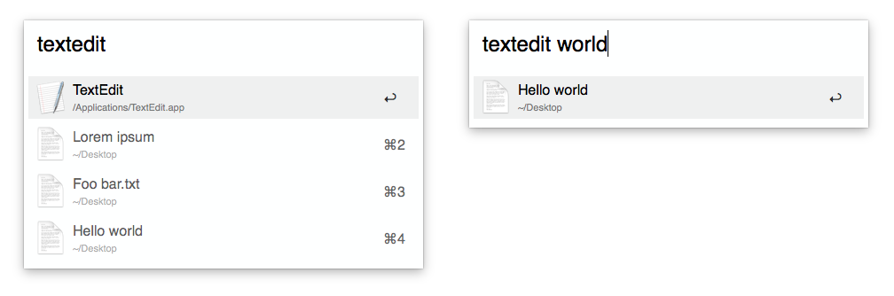

# Recently used files

This workflow for [Alfred 3](https://www.alfredapp.com/) allows you to search through the recently used files by macOS Apps which use the _Recent Items_ set in the System Preferences.
By providing a Keyword (the App name i.e.) it will show you the recently used files by this App inside Alfred to open them directly or show them in the Finder (`cmd` modifer).

Additionally the recently used files can be filtered using text input.

After you install the Workflow it is set to work with TextEdit, [MindNode](https://mindnode.com/), [OmniGraffle](https://www.omnigroup.com/omnigraffle) and [iA Writer](https://ia.net/writer). After installing the Workflow you can configure other Apps. Explanation are inside the Workflow.

## Installation

Just [download the Workflow here](https://github.com/stroebjo/alfred-recent/releases) and open it.

## Limitations

It only works only on macOS 10.11 El Capitan and above. It requires Alfred 3. Also not all Apps use this mechanism provided by macOS. For example Adobe and Microsoft Office Apps use their own implementation for recently used files. To get recently used files by Office you can use [my other Alfred Workflow](https://github.com/stroebjo/alfred-recent-office).

## Motivation

I created this workflow because some macOS Apps like MindNode show directly a new file after opening which needs to be saved or discaraded before closing the App. To circument this I created this workflow to give easy access to recently used files for further editing.
